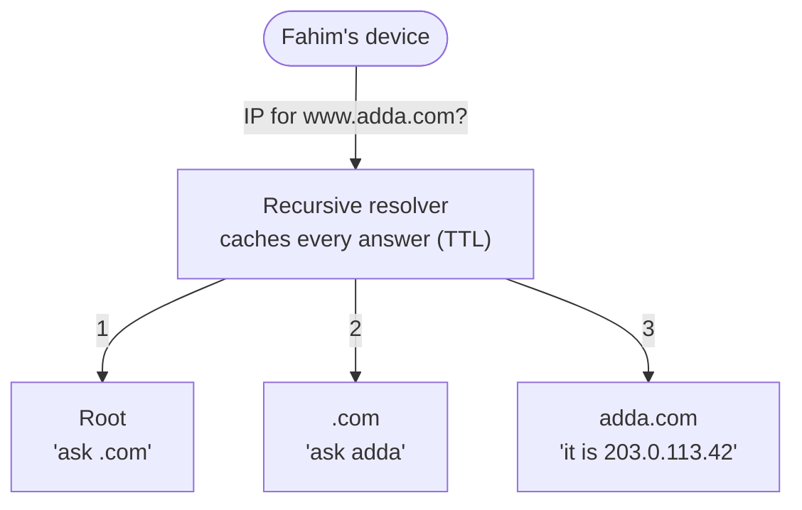

## The problem

Adda has a real name now. **Ria** paid for `adda.com` so **Fahim** would stop typing a raw IP address into his browser like it was 1994. It felt like a milestone — until the link started dying.

The trouble is that Adda still runs on the laptop under Ria's desk, behind her home internet connection, and her ISP hands that connection a *different* IP address every few days. Every time it rotates, the number the network needs to reach Ria's laptop changes — but the name Fahim typed does not. Something has to sit between the name and the number, and update itself when the number moves. And this translation happens *before every single connection*: get it slow and every page on Adda inherits the delay; get it wrong and Adda simply vanishes for Fahim, even though the laptop is humming along perfectly. This is quiet infrastructure that, when it hiccups, takes the whole site down with it.

## A first attempt

Ria's first idea was the blunt one: keep a little file mapping `adda.com` to the current IP — like the old `/etc/hosts` — and just make sure everyone has a copy.

That works when your "everyone" is Fahim and you can text him the new number. It falls apart the instant Adda has more than a handful of users. The real internet has hundreds of millions of domains changing constantly; a single shared file would be enormous, instantly stale, and impossible to update everywhere at once. Worse, one central authority editing one file becomes both a bottleneck and a single point of failure for the entire planet. A flat, centralized lookup does not scale — Ria needs something distributed and hierarchical.

## The insight

Split the phone book into a **tree**, and let each level answer only for the part it owns.

Nobody knows every name. Instead, responsibility is delegated: root servers know where to find the `.com` servers; the `.com` servers know where to find `adda.com`'s servers; and *those* servers know the actual IP of Ria's laptop. Each node hands you off to the next. Layer **caching** on top — everyone remembers answers for a while (the TTL) — and most lookups never travel the full tree at all. Distribution solves scale; caching solves speed.

## How it works

<Steps>

<Step>

### Ask the resolver

Fahim's phone asks a **recursive resolver** (usually run by his ISP, or a public one like `8.8.8.8`) to find `www.adda.com`. The resolver does the legwork for him.

</Step>

<Step>

### Walk the hierarchy

If nothing is cached, the resolver asks a **root** server, which points it to the **`.com` TLD** servers, which point it to Adda's **authoritative** name servers, which return the final IP. Three delegations, then an answer.

</Step>

<Step>

### Cache the answer

The record comes with a **TTL** (time to live), say 300 seconds. The resolver — and Fahim's OS, and his browser — remember it. For the next 5 minutes, the same lookup is answered instantly from memory, no tree walk.

</Step>

<Step>

### Reuse or refresh

Later requests hit the cache until the TTL expires. Then the resolver refreshes from the authoritative server. Short TTLs mean fast changes but more lookups; long TTLs mean fewer lookups but slow propagation.

</Step>

</Steps>

The delegation chain, top to bottom:

Common record types Ria will actually name in a design:

- **A / AAAA** — name → IPv4 / IPv6 address.
- **CNAME** — name → another name (alias, e.g. `www` → `adda.com`).
- **NS** — which name servers are authoritative for a zone.
- **MX** — mail servers for the domain.

## The numbers

Adda's real DNS behavior once the record is live:

- **Cold lookup (full tree walk):** ~4 queries, often 50–200 ms total depending on distance to each server.
- **Warm lookup (cached):** < 1 ms — served from the resolver or the OS.
- **Cache hit rate** at a busy resolver is typically **90%+**, which is why DNS rarely dominates Adda's page load.
- **TTL choices:** because Ria's home IP keeps moving, she keeps Adda's TTL low — **30–60 s** — so a change propagates fast. A stable corporate site might use **24 h** to cut lookup volume.
- **Propagation:** after Ria changes the record, old answers linger in caches worldwide for up to the *previous* TTL — so she lowers the TTL a day *before* a planned move.

<Callout type="warn" title="The TTL trade-off">
Low TTL = agility (Ria can point `adda.com` at a new IP in seconds when her ISP rotates it) but more lookups and more load on her authoritative servers. High TTL = fewer lookups and cheaper, but a bad or stale record haunts users for hours. There is no free lunch — pick the TTL that matches how fast you need to change that record.
</Callout>

<Callout type="idea" title="DNS is also a routing tool">
Because you control the answer, DNS is not just translation — it is a load-balancing and failover lever. Return different IPs to different regions (geo-DNS), rotate IPs to spread load, or drop an unhealthy server's IP to route around an outage. This is how CDNs steer you to a nearby edge — something Adda will lean on hard a few lessons from now.
</Callout>

## Practice

<Accordions>

<Accordion title="Why does a DNS lookup usually feel instant even though it can touch four servers?">

Caching at every level. Fahim's browser, his OS, and the recursive resolver all remember recent answers until the TTL expires, and a popular domain like `adda.com` sits in a resolver's cache almost permanently. The expensive full tree walk only happens on a cold miss — well over 90% of real-world lookups are cache hits served in under a millisecond.

</Accordion>

<Accordion title="Ria lowered the TTL to 60s and pointed adda.com at a new IP, but some users still hit the old laptop. Why?">

TTL only controls *future* caching. Resolvers that fetched the record while the TTL was still high (say 3600s) will keep serving the old IP until that older TTL expires. The fix is to lower the TTL *well before* the change, wait for the old TTL window to pass, and only then repoint. TTL changes propagate at the speed of the previous TTL.

</Accordion>

<Accordion title="Why is DNS a favorite target for causing (or debugging) large outages?">

It sits in front of everything. If authoritative servers go down or return bad records, healthy application servers become unreachable because nobody can find their IP. Attackers DDoS DNS for the same reason. When Ria is debugging "the whole site is down but the laptop is fine," DNS is one of the first suspects — she resolves the name manually and compares.

</Accordion>

</Accordions>

## Recap

- DNS is a **distributed, hierarchical** lookup: root → TLD → authoritative, each level delegating to the next.
- **Caching with TTLs** makes it fast — most lookups never leave the resolver.
- DNS doubles as a **routing and failover control**, but its TTL is a genuine agility-vs-load trade-off and a real single point of failure — which is exactly why Adda keeps its TTL short while its address is still moving.

<Cards>
  <Card title="How a Request Travels the Internet" href="/docs/system-design/part-1-networking/01-how-the-internet-carries-a-request" description="Where the DNS step fits in the full journey." />
  <Card title="Content Delivery Networks" href="/docs/system-design/part-1-networking/06-cdns" description="How DNS steers you to the nearest edge server." />
  <Card title="Caching Fundamentals" href="/docs/system-design/part-1-networking/07-caching-fundamentals" description="TTLs and cache hits, generalized beyond DNS." />
</Cards>

<Callout type="idea" title="In an interview">
If a design needs global failover or geo-routing, mention DNS as the first steering layer and immediately name the TTL trade-off — low for fast failover, high for fewer lookups. Interviewers love when you flag that DNS is both a routing tool and a single point of failure worth protecting.
</Callout>
