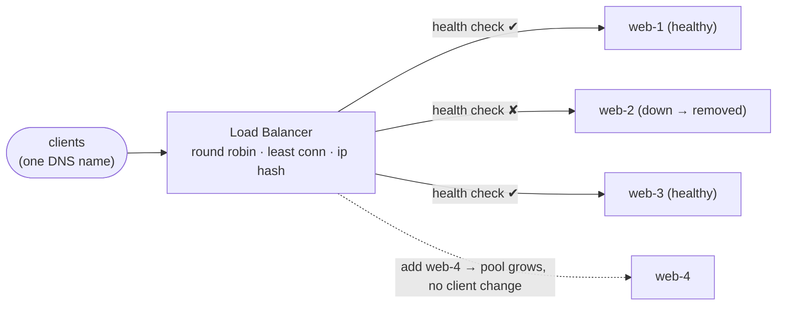

## The problem

It happens overnight. **Fahim** posts about Adda in his university group, a few hundred classmates sign up by lunch, and the laptop under **Ria's** desk — which shrugged off launch day — pins its CPU at 100%. Response times crawl. At the evening peak the process simply falls over and takes the whole product down with it. Fahim, ever the canary, texts: "it's dead again."

Ria can't hold the whole system in her head *and* fight fires at 3am, so she brings on **Tanvir**, Adda's first backend engineer. His opening question is the right one. They could buy a beefier laptop — scale *up* — but there is a ceiling, and a single machine, however big, is still a single point of failure. When it reboots, *everyone* is offline. What they actually need is a way to run *many* servers that together look like one, absorbing more traffic and surviving any single machine dying. But then: who decides which server each request goes to?

## A first attempt

Tanvir's straw-man, offered mostly to knock it down: run three identical servers and tell users "use server 1, or 2, or 3."

It falls apart immediately. Users cannot pick sanely, so traffic clumps — server 1 melts while server 3 idles. When server 2 dies, everyone pointed at it is stuck; nothing reroutes them. And every time the team adds or removes a server, they would have to update clients everywhere. Manually distributing traffic does not work. They need a single front door that hides the fleet and spreads load automatically.

## The insight

Put one component in front of the fleet whose entire job is **distributing incoming requests** across healthy servers: a **load balancer**.

Clients only ever talk to the load balancer's address. Behind it, servers come and go invisibly. The load balancer does two things that make the fleet feel like one reliable machine: it **spreads** each new request across the pool by some algorithm, and it **health-checks** every server so it can stop sending traffic to a dead one. Add servers to scale; the balancer just starts using them. This works cleanly *because* Adda's HTTP is stateless — any server can handle any request, exactly as Ria set it up back when the mobile client appeared.

## How it works

Ria and Tanvir stand up the front door:

<Steps>

<Step>

### Clients hit one address

DNS points `adda.com` at the load balancer, not at any individual server. Every request lands there first. The backend fleet is invisible to the outside world.

</Step>

<Step>

### The balancer picks a server

It applies a **distribution algorithm**: **round robin** (next server in rotation), **least connections** (the least busy server — good for uneven request costs), or **hashing** (hash the client IP or a key so the same client sticks to the same server).

</Step>

<Step>

### It health-checks constantly

The balancer pings each server (e.g. `GET /health` every few seconds). Miss a few checks and the server is pulled from the pool automatically — no human paged, no traffic lost to a dead box. When it recovers, it is added back.

</Step>

<Step>

### Layer 4 or Layer 7

An **L4** balancer routes on IP/port only — fast, protocol-agnostic, no idea what's inside. An **L7** balancer reads the HTTP request, so it can route by path or host (`/api` → API fleet, `/img` → image fleet), terminate TLS, and do smart retries — at a little more cost per request.

</Step>

</Steps>

The front-door picture:

## The numbers

What the switch actually bought Adda:

- **Vertical ceiling:** one big server might handle ~10k–50k requests/sec before saturating; scaling *out* to 20 servers behind a balancer reaches hundreds of thousands.
- **Health-check cadence:** typically every **2–10 s**, with an unhealthy threshold of ~3 misses — so a dead server is drained in **~6–30 s**.
- **Balancer overhead:** an L4 balancer adds sub-millisecond latency; an L7 balancer that parses HTTP and terminates TLS adds ~1–3 ms — usually a fine trade for its smarter routing.
- **Redundancy:** the balancer itself must not be a single point of failure — Tanvir runs at least **two** in active-passive (or active-active) with a floating IP, so losing one does not lose Adda.

<Callout type="warn" title="Sticky sessions vs even distribution">
If you store session state on individual servers, you need **sticky sessions** (hash the client to one server) — but that undermines even load spreading and means a server dying logs its users out. The cleaner path is to keep servers **stateless** and push session data to a shared store (Redis/DB), so any request can go anywhere. Stickiness buys convenience and costs balance and resilience.
</Callout>

<Callout type="idea" title="Least connections beats round robin for uneven work">
Round robin assumes every request costs the same. When some Adda requests are cheap (fetch one post) and others are expensive (load a heavy profile), round robin piles heavy work unevenly. **Least connections** routes to the currently-least-busy server and self-corrects — a better default whenever request cost varies.
</Callout>

## Practice

<Accordions>

<Accordion title="Why is Adda's stateless backend the key to painless load balancing?">

If no server holds session-specific state, the balancer can send any request to any server, so it can spread load perfectly and reroute instantly when a server dies — no user loses their session. The moment state lives on individual servers, Tanvir is forced into sticky sessions, which unbalances load and turns any server failure into logged-out users. Statelessness (push state to a shared store) is what makes the fleet truly interchangeable.

</Accordion>

<Accordion title="When would the team choose an L7 load balancer over a faster L4 one?">

When they need to make decisions based on the *content* of the request: routing `/api/*` to one fleet and `/static/*` to another, host-based routing for multiple domains, terminating TLS centrally, or doing HTTP-aware retries and header rewriting. L4 is faster and protocol-agnostic but blind to HTTP. You pay a millisecond or two at L7 for routing intelligence L4 simply cannot provide.

</Accordion>

<Accordion title="They added a load balancer and the whole site still went down when one machine failed. Which machine?">

Almost certainly the load balancer itself — they moved the single point of failure rather than removing it. A lone balancer means everything dies when it dies. The fix is to run redundant balancers (active-passive or active-active) sharing a floating/virtual IP, plus health checks, so losing one balancer fails over without an outage. Redundancy has to include the thing providing redundancy.

</Accordion>

</Accordions>

## Recap

- A load balancer is a **single front door** that spreads requests across a fleet and **health-checks** them, making many servers look like one reliable one — Adda's answer to the viral spike.
- Pick an algorithm to match the workload: **round robin** for uniform requests, **least connections** for uneven ones, **hashing** for stickiness.
- **L4** is fast and blind; **L7** is HTTP-aware and smarter. Keep backends **stateless** and make the balancer itself **redundant**.

<Cards>
  <Card title="HTTP & APIs" href="/docs/system-design/part-1-networking/03-http-and-apis" description="Why stateless HTTP is what makes any server interchangeable." />
  <Card title="DNS: The Internet's Phone Book" href="/docs/system-design/part-1-networking/02-dns" description="The layer that points clients at the balancer — and can balance too." />
  <Card title="Content Delivery Networks" href="/docs/system-design/part-1-networking/06-cdns" description="Load balancing's geographic cousin, pushing traffic to the edge." />
</Cards>

<Callout type="idea" title="In an interview">
Almost every scalable design starts with "clients → load balancer → stateless server fleet." Draw that first, then justify your algorithm choice and mention health checks and balancer redundancy unprompted. If you claim horizontal scaling, be ready to explain where session state lives — that is the follow-up interviewers always ask.
</Callout>
