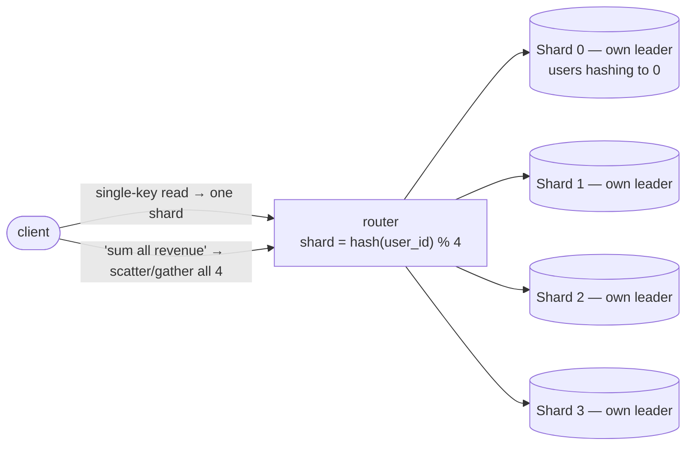

## The problem

Adda's posts table has grown to 4 terabytes and 20,000 writes per second. Shuvo has already bought the biggest instance the cloud offers, added the read replicas from last lesson, and tuned every index. Writes still funnel through one leader, and that leader is out of headroom. There is no bigger machine to buy — Ria checks the pricing page twice to be sure.

This is the wall replication cannot climb. Followers scale reads, but every write still lands on a single node. When the *write* volume or the *dataset* exceeds one machine, the only move is to stop putting all the data in one place and split it across many.

## A first attempt

The obvious split is by feature: users on one database, posts on another, likes on a third. That is *functional partitioning*, and it buys Adda room — for a while. But each of those tables can itself outgrow a machine, and now you cannot join across them either. Splitting by feature does not help when a *single table* — posts — is too big.

The real need is to cut one huge table into pieces that each live on their own machine, so that both storage and write load spread out. The question is not *whether* to split, but *how to decide which row goes where* — and that decision, the shard key, is the whole ballgame.

## The insight

Partition rows **horizontally** across nodes by a **shard key**, and use a routing rule that maps any key to its shard so every query knows exactly where to go.

Two routing strategies dominate:

- **Hash sharding:** `shard = hash(key) % N`. Spreads rows evenly and kills hotspots, but destroys ordering, so range queries must hit every shard. Naive modulo also reshuffles almost everything when `N` changes — which is why real systems use **consistent hashing** to move only a fraction of keys on a resize.
- **Range sharding:** shard 1 holds A–F, shard 2 G–M, and so on. Range queries stay local, but any skew (everyone signs up as "user000…") creates a **hot shard** doing all the work while others idle.

## How it works

<Steps>

<Step>

### Pick a shard key with high cardinality and even access

Choose a key with many distinct values that spreads both storage and traffic — for Adda, `user_id` is usually better than `country`, because a few countries would overload a few shards.

</Step>

<Step>

### Route each request through the key

The application (or a routing layer / proxy) computes the shard from the key and sends the query straight to the owning node. A single-key read stays a single-node read.

</Step>

<Step>

### Keep writes independent per shard

Because each shard is its own database with its own leader, writes now happen in parallel across N machines — total write capacity scales with N.

</Step>

<Step>

### Handle cross-shard queries carefully

A query that spans shards ("total posts this month across all users") must scatter to every shard and gather the results — slower, and only as fast as the slowest shard. Design your key so the common queries stay single-shard.

</Step>

<Step>

### Rebalance when a shard gets hot

When one shard runs hot, you split it or move ranges. Consistent hashing minimizes how many keys move; range sharding lets you split a busy range in two.

</Step>

</Steps>

## Concrete numbers

Split that 4 TB, 20k-writes/s table across 8 shards and each node holds 500 GB and ~2,500 writes/s — comfortably back inside one machine's envelope, and Adda can add shards as it grows. That is horizontal scale: capacity grows with the number of nodes instead of the size of one node.

The catch shows up in fan-out. A single-shard read stays around 1–5 ms. A cross-shard aggregate over 8 shards runs all 8 in parallel but must wait for the slowest — so p99 latency is set by the worst shard, and a query touching every shard is far more failure-prone (one slow node stalls the whole result). A hot shard taking 40% of traffic while seven idle is the classic skew failure — and the one Shuvo watches for when a post goes viral.

## When to use it

<Callout type="warn" title="The trade-off">
Sharding is the price of scale, and it is steep: you lose easy joins, cross-shard transactions become hard, and one bad shard-key choice bakes in hotspots you can only fix by re-sharding. Do not shard until a single machine plus replicas genuinely cannot cope — it is the last tool you reach for, not the first.
</Callout>

<Callout type="idea" title="The shard key is a one-way door">
Changing the shard key means re-hashing and physically moving most of your data, often with downtime. Shuvo spends real time up front modeling Adda's dominant queries so the common ones stay single-shard — because the team will live with this choice for years.
</Callout>

## Practice

<Accordions>

<Accordion title="Adda shards its users table by hash(user_id). Product asks for 'all users who signed up in the last week', sorted by date. Why is this now painful?">

Hashing scatters users across all shards with no regard to signup date, so "last week's users" live on every shard — the query must scatter to all N shards, gather partial results, and merge-sort them. Hashing optimized for even single-key access at the cost of range queries. If date-range queries were dominant, range sharding on signup time would keep them local — but then you would risk a hot shard on the newest range.

</Accordion>

<Accordion title="One of Adda's shards is at 90% CPU while the others sit near 10%. What is this called, and what usually causes it?">

A hot shard, caused by skew — the shard key does not spread load evenly. Common causes: a low-cardinality key (sharding by country puts all Bangladesh traffic on one shard), or a "celebrity" key (one viral user's data all lands on one shard). Fixes include choosing a higher-cardinality key, splitting the hot shard, or adding a salt to spread a celebrity's rows.

</Accordion>

<Accordion title="Why do teams prefer consistent hashing over plain 'hash(key) % N' when adding a new shard?">

With plain modulo, changing N from 8 to 9 changes `hash(key) % N` for almost every key, so nearly all data must move — a massive, disruptive reshuffle. Consistent hashing places shards and keys on a ring so that adding a node only moves the fraction of keys that fall in its arc (roughly 1/N of the data). It turns a full reshuffle into a small, localized migration.

</Accordion>

</Accordions>

## Recap

- Sharding splits one table horizontally across machines to scale **writes and storage** past a single node.
- Hash sharding spreads evenly but breaks range queries; range sharding keeps ranges local but risks hot shards.
- Cross-shard queries and transactions are the cost, and the shard key is a near-irreversible decision — model your queries first.

<Cards>
  <Card title="Replication" href="/docs/system-design/part-2-databases/03-replication" description="Scaling reads and surviving failure — often combined with sharding." />
  <Card title="Indexing" href="/docs/system-design/part-2-databases/02-indexing" description="Each shard still needs indexes to find rows fast." />
  <Card title="Consistency & the CAP Theorem" href="/docs/system-design/part-2-databases/05-consistency-and-cap" description="Distributing data forces consistency trade-offs." />
</Cards>

<Callout type="info" title="In an interview">
Never shard first. Say "single node, then read replicas, then shard only when writes or size exceed one machine." When you do shard, spend your words on the shard-key choice: cardinality, access pattern, hotspots, and cross-shard cost. Interviewers are testing whether you understand what sharding *breaks*, not just that it scales.
</Callout>
