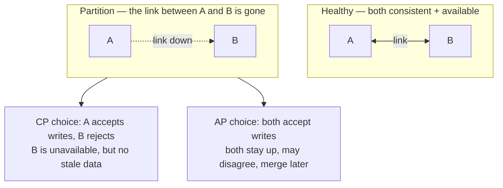

## The problem

Adda now runs its shards and replicas across two datacenters so that if one burns down, the other keeps serving. One afternoon the network link between them goes dark. Both sides are alive and taking traffic — Fahim in Dhaka, his cousin routed to the other region — but they can no longer talk to each other. A user in region A updates their bio; a request in region B reads the old one.

Now Ria faces a decision with no comfortable answer. Does she let both sides keep serving, knowing they may disagree? Or refuse writes on one side to keep everyone in agreement, making that side effectively down? The network split forced a choice she cannot avoid.

## A first attempt

The instinct is "just keep both up and reconcile later." Sometimes you can — but reconciliation means two versions of the truth, and for a wallet balance or the last ticket to a concert "later" is too late; you might sell the same seat twice.

The opposite instinct — "block writes until the link heals" — keeps everyone consistent but means an outage every time the network hiccups, which on a system Adda's size is constantly. Neither instinct is free. What Shuvo is bumping into is not a bug you can engineer away; it is a theorem about what is possible when machines cannot communicate.

## The insight

The **CAP theorem** says that when a network **partition** (P) happens, a distributed system can preserve at most one of **Consistency** (C — every read sees the latest write) and **Availability** (A — every request gets a non-error response). Partitions are a fact of networks, so the real question is *how you behave during one*:

- **CP (choose consistency):** refuse or block requests on the minority side rather than serve stale or conflicting data. Correct, but partially unavailable during the split.
- **AP (choose availability):** keep serving on both sides and reconcile afterward, accepting temporary disagreement. Always up, but reads can be stale.

When there is **no** partition, you get both C and A. CAP is only a dilemma during the split.

## How it works

<Steps>

<Step>

### Normal operation: consistency and availability coexist

While the network is healthy, writes propagate and every replica agrees. CAP costs you nothing here — the trade only appears under failure.

</Step>

<Step>

### A partition splits the cluster

A link dies or a node is isolated. Now some replicas cannot hear about writes happening on the other side. The system must decide, per request, how to respond.

</Step>

<Step>

### CP systems sacrifice availability

To avoid serving stale data, the minority side rejects reads/writes (or blocks) until it can reach a quorum. Callers see errors or timeouts, but no one ever reads a wrong value.

</Step>

<Step>

### AP systems sacrifice consistency

Both sides keep answering from their local copy. Writes are accepted everywhere and merged once the link heals — using timestamps, version vectors, or last-write-wins — so reads may be stale until convergence.

</Step>

<Step>

### After healing, state converges

The partition ends, changes flow both ways, and replicas re-agree. AP systems call the steady state they reach **eventual consistency**.

</Step>

</Steps>

## Concrete numbers

"Consistency" is really a spectrum, and where you sit on it is a latency knob. **Strong consistency** across regions means a write waits for a quorum acknowledgment — a cross-continent round trip of 100–300 ms per write. **Eventual consistency** acknowledges locally in 1–5 ms and converges in the background, usually within tens of milliseconds but seconds under a partition.

That is why Adda makes the choice *per operation*, not per system. A user's feed or a like-count is happy being AP — a stale count for 200 ms harms no one. A future Adda wallet balance or a limited-drop ticket wants CP — better a brief error than double-charging. Quorum systems tune this directly with `R + W > N` (read and write replica counts): raise them for consistency, lower them for availability and speed.

## When to use it

<Callout type="warn" title="The trade-off">
There is no "CA" system in the real world, because partitions will happen whether you plan for them or not — so you are really choosing CP or AP. Choosing consistency costs availability during splits; choosing availability costs correctness during splits. Decide based on what a *wrong answer* costs your users.
</Callout>

<Callout type="idea" title="PACELC: the half of the story CAP leaves out">
CAP only describes behavior during a partition. PACELC adds the everyday case: **E**lse (no partition), you still trade **L**atency vs **C**onsistency. Even on a healthy network, strong consistency costs round trips. So the trade-off is always present — partitions just make it stark.
</Callout>

## Practice

<Accordions>

<Accordion title="Back when Adda was a single Postgres node, was it subject to the CAP trade-off?">

Not really — CAP is about *distributed* systems, where nodes can be partitioned from each other. A single node has nothing to partition from, so it can offer both consistency and availability until it simply fails (which is an availability loss, not a CAP dilemma). The trade-off appeared the moment Adda added the replicas and shards that must communicate over a network.

</Accordion>

<Accordion title="Adda has a 'like' counter and a future wallet ledger. Which leans AP and which leans CP, and why?">

The like counter leans AP: availability matters more than exactness, and a count that is briefly off by a few during a partition harms nobody, so you keep serving and converge later. The wallet ledger leans CP: reading or writing a stale balance can double-spend money, so during a partition you would rather reject the operation than risk an incorrect answer. Same theorem, opposite costs of being wrong.

</Accordion>

<Accordion title="A vendor tells Ria their database is 'CA — consistent and available'. Why is that claim suspicious?">

Because CAP says you can only drop one property *during a partition*, and partitions are unavoidable in any real network — cables fail, switches reboot, packets drop. A truly "CA" system is one that assumes partitions never happen, which is only safe on a single node. In a distributed setting, claiming CA usually means the designer hasn't decided what happens during a split — which means the system will decide for them, badly.

</Accordion>

</Accordions>

## Recap

- During a network partition you can keep at most one of consistency and availability — that is CAP.
- CP refuses service to stay correct; AP stays up and reconciles later (eventual consistency).
- The trade is really per-operation and per-latency (PACELC): decide by what a wrong answer costs.

<Cards>
  <Card title="Replication" href="/docs/system-design/part-2-databases/03-replication" description="Sync vs async replication is a CAP choice in disguise." />
  <Card title="Transactions" href="/docs/system-design/part-2-databases/06-transactions" description="Consistency guarantees within and across machines." />
  <Card title="Sharding" href="/docs/system-design/part-2-databases/04-sharding" description="Distributing data is what makes CAP bite." />
</Cards>

<Callout type="info" title="In an interview">
Never say "my system is CA." Say "partitions are inevitable, so I choose CP here and AP there," and justify each by the cost of a wrong answer. Bonus points for noting that even without a partition you trade latency for consistency (PACELC). Interviewers want to see you assign consistency per operation, not blanket the whole design.
</Callout>
