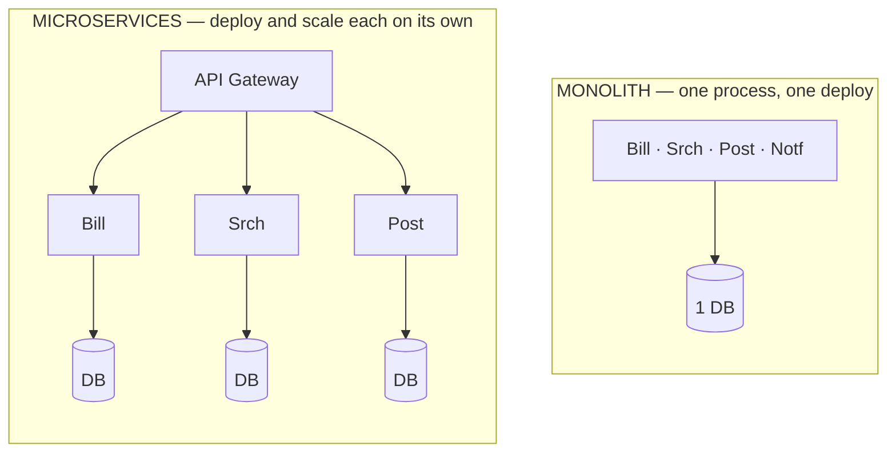

## The problem

Adda has always been one codebase. Feed, profiles, posting, search, notifications, billing —
all of it in the single repo that has grown, line by line, from the app Ria first ran on her
laptop. For two years it was a joy. One `git clone`, one command to boot the whole thing, one
place to grep when something broke.

Now Adda's team is forty-odd engineers. Every merge fights three others for the same files.
Tanvir changes a line in the notification templates and has to redeploy the *entire* app to
ship it. Last Tuesday a memory leak in image resizing — a feature nobody logs into — took
down posting and login with it. Fahim, still the canary, texts Ria at the worst hour: "can't
post, spinner forever." The thing that made Adda fast on day one is the thing slowing every
team down today.

## A first attempt

The instinct is to keep scaling the monolith: bigger machines, more replicas behind the load
balancer Tanvir stood up back in Part 1. And for a while it works — a stateless monolith
scales horizontally just fine.

But scaling the *runtime* doesn't scale the *team*. Everyone still commits to one codebase,
ships on one release train, and shares one runtime where any module can crash the process.
Adda also scales everything together: search is CPU-hungry and rarely used, yet Ria must run
20 full copies of the whole app just to give search more cores. She pays for resources Adda
doesn't need and coordination the team can't avoid.

## The insight

The real pressure isn't compute — it's **independence**. Adda's teams want to deploy, scale,
and fail on their own schedule without dragging everyone else along.

So split the app along business capabilities: a Billing service, a Search service, a
Notifications service, each its own codebase, its own database, its own deploy pipeline. Each
team owns one service end to end. That's **microservices** — not "small" services, but
*independently deployable* ones drawn around bounded contexts.

<Callout type="idea" title="The real axis is coupling, not size">
Microservices trade in-process function calls for network calls. Adda gains team autonomy and
independent scaling; it pays with latency, partial failure, and distributed data. The
question is never "which is better" — it's "is my coupling pain worse than the distributed
bill?"
</Callout>

## How it works

<Steps>

<Step>

### Find the seams

Draw boundaries where Adda's business does, not where the code happens to sit. Billing, Feed,
Posts, and Search change for different reasons and at different rates — those are natural
service edges.

</Step>

<Step>

### Give each service its own data

The rule that makes services independent: no shared database. Billing owns the billing
tables; if Search needs a price, it asks Billing over an API or listens for an event. Share a
database and you've just built a distributed monolith with all the cost and none of the
benefit — a warning Shuvo, who owns Adda's data, repeats often.

</Step>

<Step>

### Talk over the network

Services call each other via HTTP/gRPC for synchronous needs and a message queue for
asynchronous work. A gateway sits in front so clients see one address.

</Step>

<Step>

### Deploy and scale each piece alone

Search runs 30 CPU-heavy instances; Billing runs 4. A fix to Notifications ships without
touching posting. Each service has its own pipeline, dashboards, and on-call.

</Step>

</Steps>

## Concrete numbers

An in-process function call costs ~10–100 **nanoseconds**. The same call over the network
inside one datacenter costs ~0.5–2 **milliseconds** — roughly 10,000× more, before
serialization. An Adda request that fans out to 5 services in sequence turns one 1 ms
operation into 5+ ms of pure network overhead, and each hop is a chance to fail.

Failure math bites too: if each service is up 99.9% of the time, a request touching 5 of them
in series is up only 0.999⁵ ≈ **99.5%** — from ~9 hours of downtime a year to ~44. More
moving parts means more ways to be down unless Adda adds retries, timeouts, and fallbacks.

## When to use it

<Callout type="warn" title="Microservices are an organizational tool, not a performance one">
Splitting rarely makes a single request faster — it usually makes it slower. You split to let
teams move independently. If Adda still had one team of eight, a well-structured monolith (a
"modular monolith") would almost always be the right answer. Reach for microservices when
team coordination, independent scaling, or fault isolation genuinely hurt — which, at forty
engineers, they now do.
</Callout>

<Callout type="error" title="The distributed monolith trap">
Splitting into services that still share a database, deploy together, or call each other
synchronously in long chains gives you every cost of distribution and none of the autonomy.
It is the worst of both worlds — and disturbingly easy to build by accident.
</Callout>

## Practice

<Accordions>

<Accordion title="A startup with 6 engineers wants microservices 'to scale later'. What do you tell them?">

Tell them to be Adda-on-day-one, not Adda-today. Start with a modular monolith: one
deployable, but with clean internal module boundaries and no cross-module database access. You
get simplicity now and clear seams to extract services *when a real pressure appears* — a team
that needs to deploy independently, or a component that must scale differently. Premature
splitting spends your small team's time on network plumbing, distributed tracing, and deploy
pipelines instead of product.

</Accordion>

<Accordion title="Why is 'each service owns its data' the load-bearing rule?">

Because a shared database recouples everything you tried to separate. If two services read and
write the same tables, a schema change forces a coordinated deploy, and one service's slow
query starves the other. Private data lets each service change its schema freely and scale its
storage independently — the whole point of splitting. Cross-service data needs then move to
APIs or events, which is a feature, not a bug.

</Accordion>

<Accordion title="A request now touches 6 services and tail latency got worse. Why, and what helps?">

Sequential hops add their latencies, and tail latency compounds: the slowest of 6 services
often decides the response time (the "tail at scale"). Fixes: parallelize independent calls
instead of chaining them, set aggressive timeouts with fallbacks, cache hot cross-service data
(Adda already learned to cache in Part 1), and collapse chatty call chains — sometimes two
services that always talk should be one.

</Accordion>

</Accordions>

## Recap

- Microservices means *independently deployable* services drawn around business capabilities —
  the win is team autonomy and independent scaling, not raw speed.
- The load-bearing rule is data ownership: no shared database, or you've built a distributed
  monolith with all the cost and none of the payoff.
- You buy autonomy with latency, partial failure, and operational complexity. Default to a
  modular monolith and split only when a real pressure demands it — as Adda's terrifying
  deploys finally did.

<Cards>
  <Card title="The API Gateway" href="/docs/system-design/part-3-architecture/02-api-gateway" description="The single front door that hides Adda's new service sprawl from clients." />
  <Card title="Message Queues" href="/docs/system-design/part-3-architecture/03-message-queues" description="How Adda's services talk without waiting on each other." />
  <Card title="Load Balancing" href="/docs/system-design/part-1-networking/05-load-balancing" description="Spreading traffic across the many instances of each service." />
</Cards>

## In an interview

<Callout type="info" title="How to discuss this">
Never open with "I'd use microservices." Start from the pressure: team size, deploy cadence,
and which components need to scale or fail independently. Say out loud that splitting adds
latency and partial failure, propose a modular monolith as the default, and name the one rule
that separates real microservices from a distributed monolith — private data per service.
</Callout>
