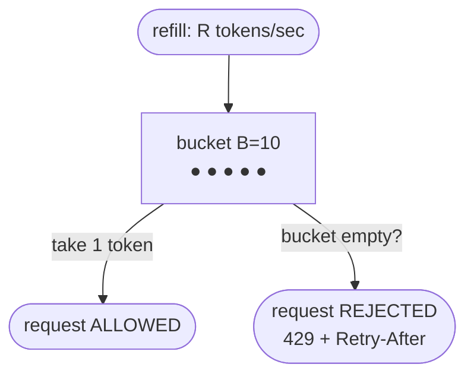

## The problem

Adda's public API hums along at a few thousand requests per second. Then one integration — a
third-party app built on Adda's API — ships a buggy retry loop with no backoff and starts
hammering the search endpoint 50,000 times a second. Shuvo's database saturates, latency for
*everyone* climbs, and requests start timing out. Fahim can't load his feed again.

The infuriating part: one client's mistake is now everyone's outage. Legitimate users can't log
in because one script is monopolizing the capacity they all share. Nabila doesn't want to ban
the client; she just wants to say "you get your fair slice, and no more." Adda needs a line
that caps how much anyone can ask for in a given window.

## A first attempt

Count requests per client and reject anything over the limit. The simplest version: a **fixed
window** — "100 requests per minute." Keep a counter per client that resets at the top of each
minute.

```
counter[client]++ each request
if counter[client] > 100: reject (429)
reset all counters at :00 of every minute
```

It mostly works, but has a nasty edge. The window is a hard boundary, so a client can send 100
requests at 12:00:59 and another 100 at 12:01:00 — **200 requests in one second**, right across
the reset. Bursts at the seam sail straight through the limit you thought you set.

## The insight

Stop thinking in hard-resetting buckets and think in *rate*. The most flexible model is the
**token bucket**: a bucket holds up to `B` tokens and refills at `R` tokens per second. Each
request must take one token; if the bucket is empty, the request is rejected.

This captures what Nabila actually wants. `R` sets the sustained rate; `B` sets how big a burst
she'll tolerate. A client that's been quiet accumulates tokens and can spike briefly (good UX
for a bursty mobile app), but can't exceed `R` on average over time. One dial for steady rate,
one for burst.

<Callout type="idea" title="Rate limit on rate, plus a burst allowance">
Token bucket = refill rate `R` (long-run cap) + bucket size `B` (instantaneous burst). It
smooths traffic without the reset-boundary loophole, which is why it's the default choice for
most APIs.
</Callout>

## How it works

<Steps>

<Step>

### Give each client a bucket

Keyed by API key, user ID, or IP. The bucket has a capacity `B` and starts full. Store two
numbers: current token count and the timestamp of the last refill.

</Step>

<Step>

### Refill lazily on each request

Don't run a timer. When a request arrives, add `(now − last_refill) × R` tokens (capped at `B`)
and update the timestamp. This computes the refill on demand — no background job.

</Step>

<Step>

### Take a token or reject

If tokens ≥ 1, subtract one and allow the request. If not, reject with **HTTP 429 Too Many
Requests** and a `Retry-After` header telling the client when a token will be available.

</Step>

<Step>

### Do it centrally for a fleet

With Adda's many gateway servers, per-server counters let a client multiply their limit by the
server count. Keep the bucket in a shared store (Redis) so all servers see one count — usually
an atomic Lua script so the read-modify-write can't race.

</Step>

</Steps>



## Concrete numbers

Set `R = 100/s` and `B = 200`. A steady client runs all day at 100 req/s. A client that was
idle for 2 s has refilled to the cap and can fire a 200-request burst instantly, then settles
back to 100/s. Try to hold 50,000/s — like Adda's runaway bot — and they get one burst of 200,
then 429s for everything above 100/s. The database never sees the flood.

A Redis-backed check adds ~0.2–1 ms per request and one small round trip. That's the tax Adda
pays on every call for fleet-wide accuracy; it's cheap next to the outage it prevents. One Redis
node handles well over 100,000 limit checks per second.

## When to use it

<Callout type="warn" title="Local is fast but leaky; distributed is accurate but costs a round trip">
Per-server in-memory limiting is nanoseconds fast but wrong across a fleet — Adda's 10 gateway
servers mean a client gets 10× their limit. A shared Redis counter is accurate but adds latency
and a hard dependency (if Redis is down, do you fail open and allow everything, or fail closed
and block everyone?). A common compromise: a generous local limit as a cheap first pass, backed
by a precise distributed limit.
</Callout>

<Callout type="info" title="Choose a fair key and return good errors">
Limiting by IP punishes everyone behind one NAT or corporate proxy; limiting by API key or user
ID is fairer. Always return `429` with a `Retry-After` and, ideally, `X-RateLimit-Remaining`, so
well-behaved clients back off gracefully instead of retrying blindly and making it worse.
</Callout>

## Practice

<Accordions>

<Accordion title="Token bucket vs leaky bucket vs sliding window — when does each fit?">

**Token bucket** allows bursts up to `B` then caps the average — best for APIs where short
spikes are fine. **Leaky bucket** drains at a fixed rate regardless of arrival, producing a
perfectly smooth output — best when a downstream system needs a steady feed (no bursts at all).
**Sliding window** fixes the fixed-window boundary bug by counting requests over the trailing 60
seconds continuously, so no seam exists — accurate but needs more per-client bookkeeping. Token
bucket is the usual default; reach for the others when you specifically need smooth output or
exact windowed counts.

</Accordion>

<Accordion title="You run 20 API servers. Why does naive per-server rate limiting fail, and how do you fix it?">

Each server keeps its own counter, so a client limited to 100/s can hit each of the 20 servers
at 100/s and get 2,000/s total — the limit is silently multiplied by the fleet size, and a load
balancer spreading their traffic makes it worse, not better. Fix it by keeping the bucket in a
shared store (Redis) that all servers read and update atomically. You trade a sub-millisecond
round trip per request for a limit that actually holds fleet-wide.

</Accordion>

<Accordion title="Redis (your rate-limit store) goes down. What should the limiter do?">

This is the fail-open vs fail-closed decision, and it's a business call. **Fail open** (allow
all requests when the limiter is unavailable) keeps Adda's API up but removes its protection
right when a flood could hurt most. **Fail closed** (reject everything) protects the backend but
turns a limiter outage into a full outage. Most APIs fail open for availability but add a crude
local fallback limit so a burst can't run completely unchecked during the gap. Decide
deliberately — don't let the default surprise you.

</Accordion>

</Accordions>

## Recap

- Rate limiting caps how much any one client can consume so a single misbehaving caller can't
  starve everyone sharing the service.
- Token bucket is the default: refill rate `R` sets the sustained cap, bucket size `B` sets the
  burst allowance, and it avoids the fixed-window boundary loophole.
- Across a fleet, keep the count in a shared atomic store, pick a fair key (API key over IP),
  return `429` with `Retry-After`, and decide fail-open vs fail-closed on purpose.

<Cards>
  <Card title="The API Gateway" href="/docs/system-design/part-3-architecture/02-api-gateway" description="The single front door where Adda's rate limits are enforced." />
  <Card title="Idempotency" href="/docs/system-design/part-3-architecture/06-idempotency" description="Handling the retries that a 429 tells clients to make." />
  <Card title="Backpressure & Circuit Breakers" href="/docs/system-design/part-4-reliability/04-backpressure-and-circuit-breakers" description="Shedding load when limits alone aren't enough." />
</Cards>

## In an interview

<Callout type="info" title="How to discuss this">
Name token bucket and explain its two dials — refill rate and burst size — then immediately
raise the distributed problem: per-server counters multiply the limit by the fleet, so you need
a shared atomic store like Redis. Mention returning `429` with `Retry-After`, choosing a fair key
over raw IP, and the fail-open vs fail-closed decision when the limiter's store is down. That
progression — algorithm, then distribution, then failure mode — is exactly what they're probing
for.
</Callout>
