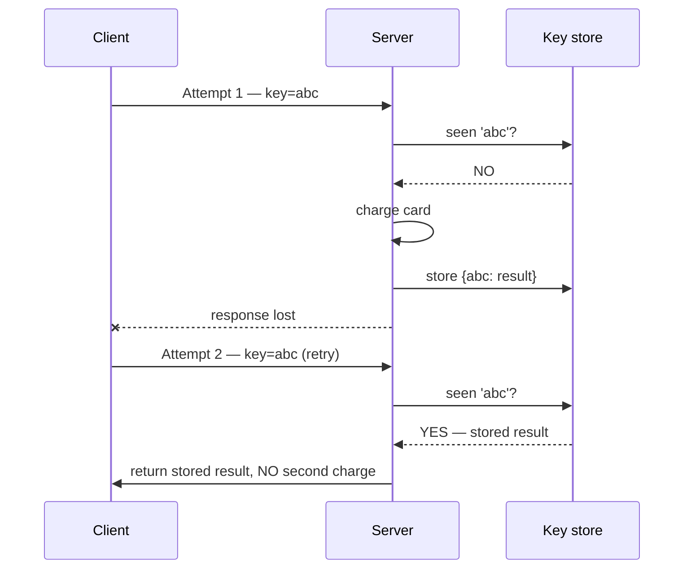

## The problem

Fahim taps "Post." The request reaches Adda, the post is saved, and then — just before the
response gets back — the connection drops. His client never sees a reply, so it does the
sensible thing: it retries. Now there are two identical posts on his profile. Annoying on a
feed; but the *same shape of bug* on an Adda Premium upgrade — "Pay $50" — charges the card
twice, and now it's real money.

Did Fahim act once or twice? From Adda's side both requests looked like valid, distinct
actions. From Fahim's side it was one tap. This isn't a rare bug you can ignore — timeouts,
mobile networks, load-balancer hiccups, the `429`/`Retry-After` retries from the last lesson,
and queue redeliveries all cause retries constantly. The question "was this already done?" is
unavoidable at Adda's scale.

## A first attempt

Just don't retry — if the client isn't sure, make it check first: "did my last payment go
through?" before sending another.

That doesn't hold up. The client genuinely *cannot* tell the difference between "the request
never arrived" and "the request succeeded but the response was lost." In the first case it must
retry or the payment is lost; in the second it must not, or the customer is double-charged. Same
symptom (no response), opposite correct actions. You can't fix this on the client — the client
lacks the information. Adda's server has to make repeating the request *safe*.

## The insight

Make the operation **idempotent**: running it once and running it five times produce the same
result. Then a retry is harmless — the client can retry freely and the worst case is a no-op.

For a payment, you can't just make "charge the card" naturally idempotent, so you attach an
**idempotency key**: the client generates a unique ID for the *intent* ("this one upgrade") and
sends it with every attempt, including retries. Adda remembers keys it has seen. If a key
arrives twice, the second time it returns the stored result instead of charging again.

<Callout type="idea" title="Idempotency turns 'exactly once' into a solvable problem">
You can't guarantee a message is *delivered* exactly once — networks won't allow it (Adda hit
this with queues and pub/sub). But you can guarantee it's *processed* exactly once by making
processing idempotent: deliver at-least-once, and let the idempotency key collapse duplicates
into one effect.
</Callout>

## How it works

<Steps>

<Step>

### Client generates a key per intent

Before the first attempt, the client creates a unique key (a UUID) for this specific action and
reuses it on every retry of that action. New purchase → new key; retry of the same purchase →
same key.

</Step>

<Step>

### Server checks the key first

On arrival, Adda looks the key up in a store. If it's new, it records the key as "in progress"
and proceeds. If it already exists, it skips the work entirely.

</Step>

<Step>

### Do the work and store the result atomically

The server charges the card and, in the same transaction, saves the outcome against the key.
Atomicity matters: the charge and the "this key is done, here's the result" record must commit
together, or a crash between them reopens the double-charge window.

</Step>

<Step>

### Replay the stored result on a duplicate

When the retry arrives with the same key, the server finds the completed record and returns the
*original* response — same charge ID, same status — without touching the card. The client gets a
clean answer and the customer is charged once.

</Step>

</Steps>

## Concrete numbers

The key check is one indexed lookup — ~0.2–1 ms against Redis or a primary-key row — added to
every write request. Cheap insurance against charging a customer twice.

Adda doesn't keep keys forever. Retries happen within seconds to minutes, so a 24-hour retention
window covers virtually every legitimate retry while keeping the store small: 1 million
payments/day at ~100 bytes/key is ~100 MB — trivial. Note that idempotency only guards *writes*;
reads (`GET`) are naturally idempotent and need no key at all. Same for `PUT` ("set display name
to X" is safe to repeat) and `DELETE`, whereas a raw `POST` ("create this post," "add $50") is
the dangerous one that needs a key.

## When to use it

<Callout type="warn" title="The dedupe and the effect must be atomic">
The whole scheme collapses if you charge the card and *then* separately record the key, because a
crash in between leaves the card charged but the key unrecorded — the retry sees a "new" key and
charges again. Store the key and its result in the same transaction as the effect (or use the
card charge's own unique constraint as the idempotency guard). Two writes that should be one is
the classic way this bug survives — the transactions Adda learned in Part 2 are exactly the tool.
</Callout>

<Callout type="error" title="Same key must mean the same request">
If a client reuses a key for a *different* payment (say it recycles keys), the server returns the
old result and silently drops the new charge. Guard against it: store a hash of the request body
with the key and reject a reused key whose body doesn't match, with a `409 Conflict`. A key
identifies one intent — never two.
</Callout>

## Practice

<Accordions>

<Accordion title="Which HTTP methods are naturally idempotent, and which one always needs help?">

`GET`, `PUT`, and `DELETE` are defined to be idempotent: reading, setting a value to X, or
deleting a resource give the same end state no matter how many times you repeat them (`PUT
display_name=Fahim` is safe; so is deleting an already-deleted row). `POST` is the odd one out —
it usually means "create a new thing" or "add to a total," so repeating it creates duplicates or
double-adds. That's exactly why Adda's post-creation and payment endpoints (`POST`) are where you
attach an idempotency key.

</Accordion>

<Accordion title="Two retries with the same key arrive at the same instant on two servers. What breaks, and how do you prevent it?">

Both can check the store, both see "not seen," and both charge — the race defeats the whole
scheme. Prevent it by making "claim the key" atomic: insert the key with a unique constraint (the
second insert fails) or use an atomic set-if-absent. The loser of the race then either waits for
the winner's result or returns "in progress." The lookup can't be a separate read followed by a
write — the check and the claim must be one atomic operation.

</Accordion>

<Accordion title="People say queues give 'exactly-once' delivery. Why is idempotency still the real answer?">

Because exactly-once *delivery* is essentially impossible over an unreliable network: the sender
can't tell whether a lost ack means the message wasn't delivered or the ack was. So systems
deliver at-least-once and accept occasional duplicates — as Adda's queue and pub/sub both do.
Idempotency moves the guarantee from delivery to *processing* — the message may arrive twice, but
processing it twice has the same effect as once. "Exactly-once" is achievable as an outcome
(idempotent processing over at-least-once delivery), not as a delivery guarantee.

</Accordion>

</Accordions>

## Recap

- Retries are unavoidable because a client can't distinguish "request lost" from "response lost"
  — so the server must make repeating a request safe.
- An idempotency key names the *intent*; the server records it and replays the stored result on
  any duplicate, charging once no matter how many retries arrive.
- Store the key and its effect atomically, claim the key atomically to beat races, and bind a key
  to one request body — then at-least-once delivery becomes exactly-once processing.

<Cards>
  <Card title="Message Queues" href="/docs/system-design/part-3-architecture/03-message-queues" description="The at-least-once delivery that makes idempotency mandatory." />
  <Card title="Rate Limiting" href="/docs/system-design/part-3-architecture/05-rate-limiting" description="The 429s and Retry-After that trigger client retries." />
  <Card title="Transactions" href="/docs/system-design/part-2-databases/06-transactions" description="The atomicity that keeps the dedupe and the effect together." />
</Cards>

## In an interview

<Callout type="info" title="How to discuss this">
Lead with why retries are inevitable — the client can't tell a lost request from a lost response
— so the server must make the operation safe to repeat. Introduce the idempotency key, then earn
credit with the two hard parts: store the key and its effect in one atomic transaction, and claim
the key atomically so concurrent retries can't both proceed. Close with the framing interviewers
love: exactly-once delivery is impossible, so you get exactly-once *processing* by making
at-least-once delivery idempotent.
</Callout>
