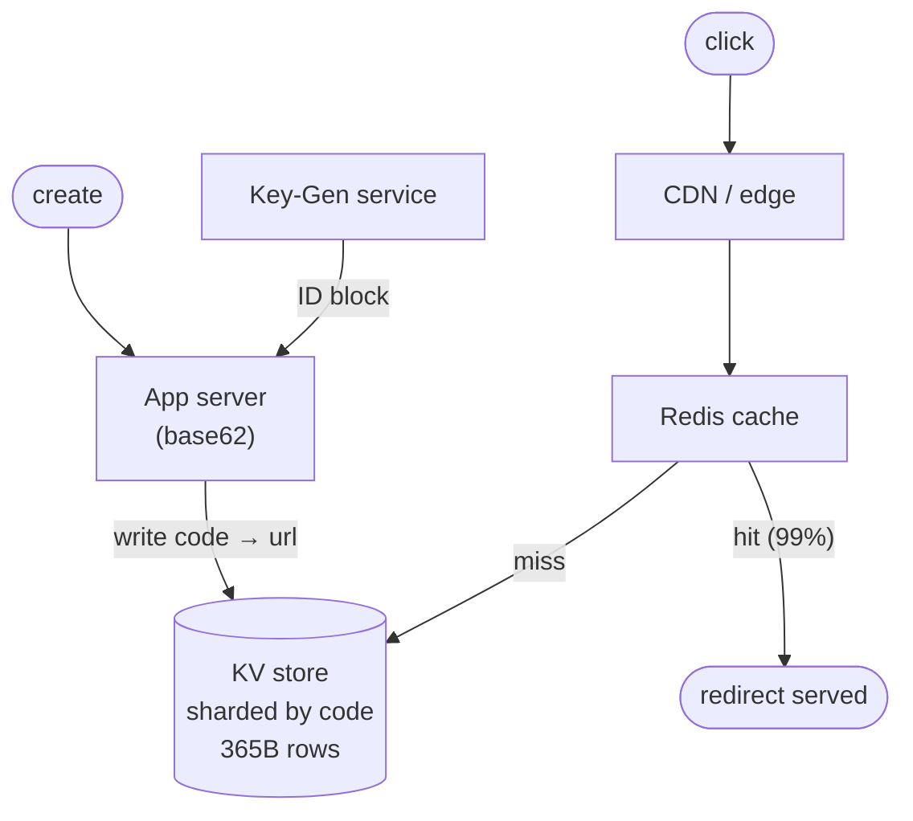

## The problem

Adda is finally big enough to hire, and **Nabila** has volunteered to run the system-design interviews. To calibrate — and to warm up the whole team before the real Adda case studies — she puts a classic on the whiteboard one Friday afternoon. **Fahim** kicks it off with a real gripe: he pasted a 400-character tracking URL into an Adda post and it ate half his character budget. He wants Adda to hand him back `sho.rt/x7Qa` instead, and when anyone taps it, send them straight to the original. Easy, says Ria — a table with two columns.

Then **Tanvir** plays interviewer. "Marketing runs a campaign, the short link goes out to ten million inboxes, and every click hits your one database row at the same instant." The "trivial" version melts. The real problem isn't shortening a link once; it's serving billions of redirects a day, fast, without ever giving two different URLs the same code.

## Requirements

Pin these down before drawing anything — Nabila is watching how the room scopes.

**Functional**

- Create a short code for a long URL.
- Redirect a short code to its original URL.
- Optional: custom aliases, expiry dates, click analytics.

**Non-functional**

- Redirects must be fast (< 50 ms) and highly available — a broken redirect is a dead link.
- Codes must be unique and hard to guess sequentially.
- The system is overwhelmingly **read-heavy**.

## A scale estimate

Numbers turn hand-waving into engineering, so **Shuvo** grabs the marker. Assume:

- **100 M** new URLs per day → ~1,160 writes/sec average, call it **~5,000/sec** at peak.
- Read:write ratio of **100:1** → ~500 K redirects/sec at peak.
- Store links for **10 years**: 100 M × 365 × 10 ≈ **365 billion** rows.
- Each row ~500 bytes → ~**180 TB**. Too big for one machine — this is why we shard.

The redirect path is the hot path. Optimize everything around making that read cheap.

## The insight

A redirect is just a key-value lookup: short code → long URL. No joins, no transactions, no relational schema on the hot path — you need a fast dictionary, the same instinct behind the cache Ria added back in Part 1. The only genuinely hard part, Tanvir notes, is **minting unique codes at 5,000/sec across many machines** without coordination on every request.

## How it works

<Steps>

<Step>

### Pick the code format

Use base62 (`a–z`, `A–Z`, `0–9`). Seven characters give 62⁷ ≈ **3.5 trillion** combinations — comfortably past the 365 B ceiling. Six characters (56 B) is close but risky, so budget seven.

</Step>

<Step>

### Generate the code without collisions

The naive approach — random 7 chars, then "check if it exists" — needs a read before every write, and collisions rise as the table fills. Instead, hand each app server a **pre-allocated range of IDs** from a central counter, then base62-encode the ID.

A key generation service (or a Redis `INCR`, or a Snowflake-style ID) hands out block `[1,000,000 – 1,000,999]` to one server. That server burns through its block locally with zero coordination, and asks for a new block when it runs low. No collisions, no read-before-write.

</Step>

<Step>

### Store the mapping

Write `code → long_url` into a partitioned key-value store — the same [sharding](/docs/system-design/part-2-databases/04-sharding) trick Shuvo pulled in Part 2 — sharded by the code itself. The code is a great shard key: high cardinality, uniform, and exactly what every read queries by.

</Step>

<Step>

### Serve the redirect

On a click, look up the code and return an HTTP **301/302** with a `Location` header. Check the cache first; only fall through to the database on a miss.

</Step>

</Steps>

## Key decisions and trade-offs

<Callout type="idea" title="301 vs 302 redirect">
A **301 (permanent)** lets browsers and proxies cache the redirect, cutting load dramatically — but you lose per-click analytics and can never repoint that code. A **302 (temporary)** forces every click through your servers, so you keep analytics and control at the cost of traffic. Most shorteners choose 302 for exactly this reason.
</Callout>

<Callout type="warn" title="Hashing is the wrong tool">
It's tempting to `md5(url)` and take the first 7 chars. But two different URLs can collide, the same URL always yields the same code (bad if two users want separate analytics), and you're back to read-before-write. A monotonic ID + base62 sidesteps all of it.
</Callout>

Custom aliases live in the same table but are checked for uniqueness on write — the one place a read-before-write is unavoidable, and that's fine because custom aliases are rare.

## Bottlenecks and how to scale

- **Read hot path:** cache aggressively. A [cache](/docs/system-design/part-1-networking/07-caching-fundamentals) holding the hottest ~20% of codes serves >95% of traffic from memory. Popular campaign links can even be pushed to the CDN edge.
- **Storage:** 180 TB won't fit on one node, so shard by code. Consistent hashing keeps rebalancing cheap when you add nodes.
- **The counter:** a single global counter is a single point of failure. Block-allocation (1,000 IDs at a time) means the counter is touched once per 1,000 writes, not once per write. Multiple key-gen replicas each own disjoint ranges.
- **Availability:** replicate each shard. A redirect must survive a node loss, so favor availability — a slightly stale mapping is acceptable, a down link is not.

## Practice

<Accordions>

<Accordion title="Why prefer a counter + base62 over random codes or hashing?">

A counter guarantees uniqueness by construction, so you never do a read-before-write on the hot create path, and collisions are impossible. Base62 encoding turns the growing integer into a short, URL-safe string. Random codes and hashes both reintroduce collision checks and get worse as the keyspace fills. The one downside of a raw counter is that codes are sequential and guessable; if that matters, XOR the ID with a secret or interleave bits before encoding.

</Accordion>

<Accordion title="A single campaign link gets 200K clicks/sec. What breaks and how do you fix it?">

That's a hot key — all traffic lands on one shard and one cache entry. Because a redirect is immutable, you can replicate that single entry into every cache node (or many), and even serve it from the CDN with a long TTL. The database shard barely notices because nearly every read is a cache hit. This is why immutable, cacheable data is such a gift.

</Accordion>

<Accordion title="How do you support link expiry without scanning 365 billion rows?">

Store an `expires_at` field and check it lazily on read — if a looked-up code is expired, return 404 and evict it. For reclaiming storage, run a background job partitioned by shard that deletes expired rows in batches, or use the store's native TTL if it has one. You never scan the whole table synchronously.

</Accordion>

</Accordions>

## Recap

- A URL shortener is a **read-heavy key-value** problem: `code → url`, cached hard.
- Mint codes with a **counter + base62** and **block allocation** to avoid coordination and collisions.
- **Shard by code**, replicate for availability, and let immutability make caching trivial.

<Cards>
  <Card title="Caching Fundamentals" href="/docs/system-design/part-1-networking/07-caching-fundamentals" description="Why the redirect path lives or dies on cache hit rate." />
  <Card title="Sharding" href="/docs/system-design/part-2-databases/04-sharding" description="Splitting 180 TB across nodes with the code as shard key." />
  <Card title="Design a News Feed" href="/docs/system-design/part-5-case-studies/02-design-a-news-feed" description="The next case study — Adda's own feed, at scale." />
</Cards>

<Callout type="info" title="In an interview">
Lead with requirements and a back-of-envelope estimate — that read:write ratio is the whole story. Say "reads dominate, so I optimize the redirect," then reach for a counter + base62 and justify it against hashing. Bring up 301 vs 302 unprompted; it signals you've thought past the happy path.
</Callout>
