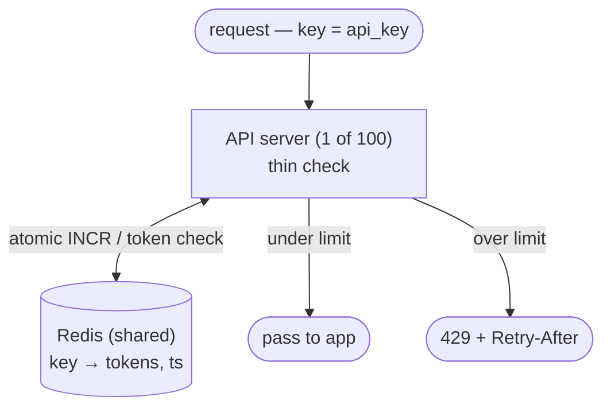

## The problem

Nabila never liked the rate limiter the team bolted on back in Part 3, the night a bot hammered Adda's API. It worked, but it was a quick patch. So the team runs a proper design drill to build it end to end. The scenario is the one that started it: a single abusive client hammers Adda's API 10,000 times a second, and the database — sized for normal traffic — falls over, taking every other user down with it. They want a bouncer at the door: "this key gets 100 requests per minute, no more." On one server that's a counter in memory. Done in five minutes.

Then Tanvir reminds the room that Adda now runs **a hundred** API servers behind a load balancer, and any request can hit any one of them. Each server sees only its own slice of the traffic. A client doing 100 req/min spread across 100 servers looks like 1 req/min to each — so the "100/min" limit silently becomes "10,000/min". The whole difficulty is that the count must be **shared**.

## Requirements

**Functional**

- Limit requests per client (by API key, user ID, or IP) to N per time window.
- Reject over-limit requests with **HTTP 429** and a `Retry-After` header.
- Configurable rules per endpoint / per tier.

**Non-functional**

- Low latency — the limiter is on every request's hot path, so it must add < 5 ms.
- Accurate enough that the limit means something, without a synchronous global lock per request.
- Highly available: if the limiter dies, decide fail-open vs fail-closed deliberately.

## A scale estimate

Shuvo sketches the load the limiter has to sit in front of:

- **1 M requests/sec** across the fleet, each needing a limit check.
- 100 servers, so ~10 K checks/sec/server locally, but the *state* is global.
- Millions of distinct clients → millions of counters, each tiny (a count + a timestamp).
- Every request does at least one read-modify-write on shared state. That store is the crux.

## The insight

You can't keep the count in each server's memory — it has to live in **one shared, fast store** that all servers read and increment atomically. Redis is the standard choice: an in-memory store (the same kind Adda leaned on for caching in Part 1) with atomic operations (`INCR`, `EXPIRE`) and sub-millisecond latency. The real design work is then choosing an *algorithm* that trades accuracy against cost, because a naive shared counter has a nasty burst bug.

## The algorithms

<Steps>

<Step>

### Fixed window counter

Keep one counter per client per fixed minute: key `user:123:12:05`, `INCR` it, reject past N. Simple and cheap. The flaw: a client can send N requests at 12:05:59 and N more at 12:06:00 — **2N requests in one second**, straddling the window boundary.

</Step>

<Step>

### Sliding window log

Store a timestamp for every request in a sorted set; count how many fall in the last 60 seconds. Perfectly accurate, no boundary burst — but you store one entry per request, which is expensive in memory at 1 M req/sec.

</Step>

<Step>

### Sliding window counter

A weighted blend: keep the current and previous fixed-window counts, and estimate the rolling count as `current + previous × (overlap fraction)`. Smooths the boundary burst at a fraction of the log's memory. A great default.

</Step>

<Step>

### Token bucket

Each client has a bucket of tokens refilled at a steady rate; each request spends one; empty bucket → reject. Allows short bursts (up to bucket size) while capping the long-run rate. Only two numbers per client — token count and last-refill time — so it's memory-cheap and the industry favorite.

</Step>

</Steps>

## Key decisions and trade-offs

<Callout type="idea" title="Token bucket is the usual answer">
It captures the two things users actually want — a sustainable average rate *and* tolerance for short bursts — with just two numbers per client. Fixed-window is simpler but bursts at boundaries; the sliding log is exact but memory-hungry. Name the trade and pick token bucket unless the interviewer wants strictness.
</Callout>

<Callout type="warn" title="The shared store is a bottleneck and a dependency">
Every request touching Redis adds a network hop and makes Redis a hot dependency. Mitigate with a **local token cache**: each server leases a small batch of tokens from Redis and spends them locally, syncing periodically. This trades a little accuracy (a client might slightly exceed the limit across servers) for a massive drop in Redis traffic.
</Callout>

<Callout type="error" title="Fail open or fail closed?">
If the rate-limit store is unreachable, do you allow all traffic (fail open) or block it (fail closed)? This is Mou's call, and it's exactly the availability trade-off from Part 4. Fail-open keeps Adda working during a limiter outage but removes your protection exactly when you might need it; fail-closed protects the backend but turns a limiter blip into a full outage. Most public APIs fail open — availability wins — but say it out loud and justify it.
</Callout>

## Bottlenecks and how to scale

- **Redis throughput:** at 1 M checks/sec, use local batching (lease-and-spend) so most requests never hit Redis. Shard Redis by client key if a single node saturates.
- **Latency:** keep the check in-process where possible; the network round-trip to a shared store is the dominant cost, so amortize it.
- **Atomicity:** do the read-modify-write as one atomic op — a Lua script in Redis — so two servers can't both "see 99, write 100."
- **Coordinated backpressure:** a rate limiter is one layer; pair it with [backpressure and circuit breakers](/docs/system-design/part-4-reliability/04-backpressure-and-circuit-breakers) — Mou's Part 4 tooling — so the system sheds load gracefully rather than just returning 429s.

## Practice

<Accordions>

<Accordion title="Show the boundary-burst bug in a fixed-window limiter with a concrete example.">

Limit is 100/minute. A client sends 100 requests at 12:00:59.9 — all counted in the 12:00 window, all allowed. At 12:01:00.1 a fresh window opens, and they send 100 more — all allowed again. That's 200 requests in ~0.2 seconds, double the intended rate, even though no single window exceeded 100. The sliding window counter fixes this by weighting the previous window's count into the current estimate, so those first 100 still "count" for most of the next minute.

</Accordion>

<Accordion title="Why is per-server in-memory counting wrong, and what's the minimum fix?">

Each server only sees the requests routed to it. With 100 servers and round-robin balancing, a client's traffic is split ~100 ways, so each server's local counter reaches ~1% of the true rate and never trips. The minimum fix is a single shared, atomic counter (Redis) that all servers increment — now the count reflects global traffic. The refinement is local token leasing to avoid a Redis hit on every request.

</Accordion>

<Accordion title="How do you keep the check fast when the counter lives on a remote Redis?">

Don't consult Redis on every single request. Have each server lease a batch of tokens (say 10 at a time) from Redis with one atomic operation, then spend those locally with zero network cost until the batch runs low. Refill in the background. This cuts Redis traffic by ~10× and keeps p99 latency low, at the cost of slight over-admission at the edges — usually an acceptable trade for a rate limiter, which is a guardrail, not a billing meter.

</Accordion>

</Accordions>

## Recap

- The distributed challenge is **shared state**: the count must be global, or splitting traffic across servers defeats the limit.
- **Token bucket** balances average rate with burst tolerance using two numbers per client; know fixed/sliding window as alternatives.
- Use an **atomic op on a fast shared store**, **lease tokens locally** to cut load, and decide **fail-open vs fail-closed** on purpose.

<Cards>
  <Card title="Rate Limiting" href="/docs/system-design/part-3-architecture/05-rate-limiting" description="The concept lesson this case study builds on." />
  <Card title="Caching Fundamentals" href="/docs/system-design/part-1-networking/07-caching-fundamentals" description="Why an in-memory store like Redis is the right home for counters." />
  <Card title="Backpressure & Circuit Breakers" href="/docs/system-design/part-4-reliability/04-backpressure-and-circuit-breakers" description="The next layer of load protection past the limiter." />
</Cards>

<Callout type="info" title="In an interview">
The one-server-to-many-servers pivot is the whole point — get to "the count must be shared" fast, then Redis appears naturally. Walk the algorithms in order (fixed → sliding → token bucket), stating each one's flaw, and land on token bucket. Bring up fail-open vs fail-closed and local token leasing unprompted; they show you're thinking about the limiter as production infrastructure, not a toy counter.
</Callout>
